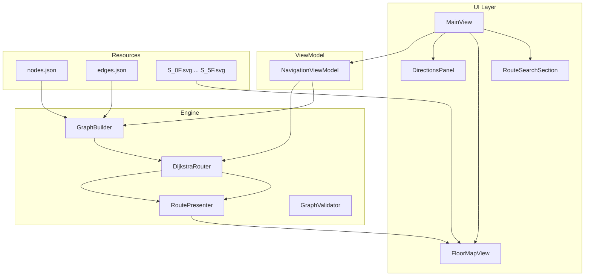

# UniNavi iOS

**UniNavi** 是一款面向大学校园的室内导航 iOS 应用。用户输入起点与终点（房间号或地标名），App 在离线图数据上计算最短路径，在 SVG 平面图上叠加路线，并提供分步英文导航指引。当前覆盖 **S 教学楼** 的 **0F–5F** 共 6 层。

**UniNavi** is a campus indoor navigation app for iOS. Users enter a start point and destination (room number or landmark), and the app computes the shortest path on offline graph data, overlays the route on SVG floor plans, and provides step-by-step directions in English. It currently covers **Building S**, floors **0F–5F** (6 levels).

| | |
|---|---|
| **Bundle ID** | `guameezia.uni-navi-ios` |
| **Version** | 1.0 |
| **Minimum iOS** | 16.0 |
| **Dependencies** | None (pure Swift / SwiftUI) |

<!-- TODO: add screenshots -->

---

## 功能特性 / Features

| 功能 Feature | 说明 Description |
|---|---|
| 起终点搜索 Search | 输入房间号或地标，最多 8 条自动补全（仅地标节点）<br>Autocomplete up to 8 suggestions for rooms and landmarks |
| 路径规划 Routing | 基于图的最短路径；同层走走廊，跨层经电梯/楼梯<br>Graph-based shortest path; flat corridors on same floor, elevators/stairs across floors |
| 双路线模式 Route modes | **Comfort**（优先电梯）与 **Fast**（优先楼梯）<br>**Comfort** (elevator-first) and **Fast** (stairs-first) |
| 楼层地图 Floor map | `WKWebView` 加载 SVG + SwiftUI `Canvas` 绘制绿色路线<br>SVG floor plans via `WKWebView` with green route overlay on `Canvas` |
| 分步指引 Directions | 可折叠的英文逐步导航说明<br>Collapsible step-by-step directions in English |
| 数据校验 Validation | 启动时校验节点/边合法性，错误输出到控制台<br>Graph validation on launch; errors logged to console |

---

## 技术栈 / Tech Stack

| 类别 | 技术 |
|---|---|
| Language | Swift 5 |
| UI | SwiftUI |
| Architecture | MVVM (`NavigationViewModel` + Views) |
| Map rendering | `WKWebView` (SVG) + SwiftUI `Canvas` (route overlay) |
| Routing | Custom Dijkstra + shaft (elevator/stair) composition |
| Data | Bundle JSON + SVG (fully offline) |
| Testing | Swift Testing (unit) + XCTest (UI) |

---

## 项目结构 / Project Structure

```
uni-navi-ios/
├── uni-navi-ios/
│   ├── App/              # App entry — UniNaviIOSApp.swift
│   ├── ViewModels/       # NavigationViewModel (state hub)
│   ├── Views/            # MainView, FloorMapView, search, floor picker, directions
│   ├── Engine/           # GraphBuilder, DijkstraRouter, RoutePresenter, GraphValidator
│   ├── Models/           # Node, Edge, RouteTypes
│   ├── Config/           # MapConstants (floor order, SVG viewBox, coordinate offsets)
│   └── Resources/
│       ├── Data/S/       # nodes.json (539), edges.json (613)
│       └── Maps/         # S_0F.svg … S_5F.svg
├── uni-navi-iosTests/    # Unit tests (Swift Testing)
└── uni-navi-iosUITests/  # UI tests (launch template)
```

### 模块说明 / Module Overview

| 模块 Module | 职责 Responsibility |
|---|---|
| `NavigationViewModel` | 加载图数据、搜索补全、调用路由引擎、管理楼层与路线状态<br>Loads graph, search autocomplete, routing, floor/route state |
| `GraphBuilder` | 从 JSON 构建无向邻接表<br>Builds undirected adjacency list from JSON |
| `DijkstraRouter` | Dijkstra 最短路径 + 跨层竖井组合搜索<br>Dijkstra shortest path + cross-floor shaft routing |
| `RoutePresenter` | 路线分段、楼层过渡、英文指引文案<br>Route segments, floor transitions, direction text |
| `GraphValidator` | 节点/边合法性校验<br>Node and edge validation |
| `FloorMapView` | SVG 平面图 + 路线叠加层<br>SVG floor plan + route overlay |

---

## 架构与数据流 / Architecture



**用户流程 / User flow:** 选择起点/终点 → 点击 Go → Dijkstra 算路 → 地图显示路线 → 切换楼层/路线模式 → 查看 Directions

---

## 路由算法 / Routing Algorithm

### 图构建 Graph Building

`GraphBuilder.createGraph(enabledBuildings:)` 从 `Resources/Data/{Building}/` 加载 `nodes.json` 与 `edges.json`，构建无向邻接表（每条边双向加入）。默认仅启用建筑 `"S"`。

### 三种搜索模式 Three Search Modes

| 方法 Method | 用途 Purpose |
|---|---|
| `shortestPath` | 全图最短路径 Full-graph shortest path |
| `shortestPathFlatOnly` | 排除电梯/楼梯/隧道，仅平面行走 Flat corridors only (same-floor routes) |
| `findPreferredRoute` | 跨层：平面段 + 竖井段 + 平面段 Cross-floor: flat + shaft + flat |

### 跨层逻辑 Cross-Floor Logic

跨层时识别电梯/楼梯 **Shaft**（连通分量），按 `RouteMode` 排序优先级：

| 模式 Mode | 优先级 Priority |
|---|---|
| **Comfort** | 电梯 > 楼梯 > 3F 出入口 |
| **Fast** | 楼梯 > 3F 出入口 > 电梯 |

同层起终点：两种模式结果相同。跨层时分别计算 comfort/fast；若路径不同，UI 显示路线切换器。

### 地图坐标映射 Map Coordinate Mapping

`FloorMapView` 使用 `MapConstants` 中的 `viewBoxes` 与 `modelOffsets` 将节点 `(x, y)` 映射到 Canvas 坐标，绘制绿色正交化折线路线。

---

## 数据格式 / Data Format

### Node (`Resources/Data/S/nodes.json`)

```json
{
  "id": "S_0F_SA007",
  "type": "room",
  "label": "SA007",
  "building": "S",
  "floor": "0F",
  "block": "SA",
  "x": 640,
  "y": 265
}
```

| 字段 Field | 说明 Description |
|---|---|
| `id` | 唯一标识，格式 `{building}_{floor}_{block}{number}` Unique ID |
| `type` | `room`, `junction`, `elevator`, `staircase`, `entrance`, `exit`, `tunnel`, `toilet`, `food` 等 |
| `label` | 显示名称（房间号或地标名）Display name |
| `x`, `y` | 平面图坐标（与 SVG viewBox 对应）Map coordinates |

仅 `isLandmark` 节点（`room`, `staircase`, `elevator`, `entrance`, `exit`, `tunnel`, `toilet`, `food`）参与搜索补全。`junction` 为走廊交叉点，不参与搜索。

### Edge (`Resources/Data/S/edges.json`)

```json
{
  "from": "S_0F_SA_J_W1",
  "to": "S_0F_SA_J_W2",
  "distance": 65,
  "directionHint": "east",
  "edgeType": "flat"
}
```

| 字段 Field | 说明 Description |
|---|---|
| `from`, `to` | 节点 ID Node IDs |
| `distance` | 边权重（步行距离）Edge weight |
| `directionHint` | 可选方向提示（如 `east`）Optional direction hint |
| `edgeType` | `flat`, `staircase`, `elevator`, `tunnel` |

### 地图资源 Map Assets

SVG 平面图位于 `Resources/Maps/`，由 draw.io / diagrams.net 导出。楼层与资源名映射在 `MapConstants.mapAssets` 中配置（如 `S` + `1F` → `S_1F.svg`）。

---

## 开发与运行 / Development

### 环境要求 Requirements

- macOS + **Xcode 16.2+**
- iOS **16.0+** 模拟器或真机
- Apple Developer 账号（Automatic Signing）

### 在 Xcode 中运行 Run in Xcode

1. 打开 `uni-navi-ios.xcodeproj`
2. 选择 scheme **uni-navi-ios**
3. 选择 iOS 模拟器或真机
4. 按 **⌘R** 运行

### 命令行构建 Build from CLI

```bash
xcodebuild -project uni-navi-ios.xcodeproj \
  -scheme uni-navi-ios \
  -destination 'platform=iOS Simulator,name=iPhone 16' \
  build
```

### 运行测试 Run Tests

```bash
# 单元测试 Unit tests
xcodebuild test -project uni-navi-ios.xcodeproj \
  -scheme uni-navi-ios \
  -destination 'platform=iOS Simulator,name=iPhone 16' \
  -only-testing:uni-navi-iosTests

# UI 测试 UI tests
xcodebuild test -project uni-navi-ios.xcodeproj \
  -scheme uni-navi-ios \
  -destination 'platform=iOS Simulator,name=iPhone 16' \
  -only-testing:uni-navi-iosUITests
```

单元测试（`uni-navi-iosTests/UniNaviTests.swift`）使用 Swift Testing，覆盖图构建、Dijkstra 路由、路线呈现与数据校验。UI 测试目前为启动/截图模板，尚未覆盖搜索与算路交互。

---

## 扩展新建筑 / Adding a New Building

1. **添加图数据** — 在 `Resources/Data/{Building}/` 下创建 `nodes.json` 与 `edges.json`
2. **添加平面图** — 在 `Resources/Maps/` 下添加 `{Building}_{Floor}.svg`
3. **更新 MapConstants** — 在 `viewBoxes`、`modelOffsets`、`mapAssets` 中配置新建筑的 viewBox、坐标偏移与资源名
4. **启用建筑** — 修改 `GraphBuilder.createGraph(enabledBuildings:)` 将新建筑加入列表

`GraphValidator` 会校验楼层范围（0F–5F）、节点 ID 唯一性，以及 S 楼 4F/5F 禁止跨 block 的 room-to-room 边等规则。扩展新建筑时请相应调整校验逻辑。

---

## License

待补充 / TBD
